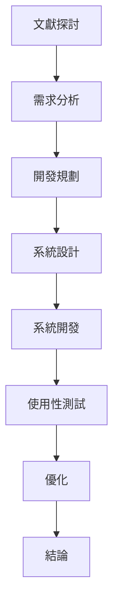
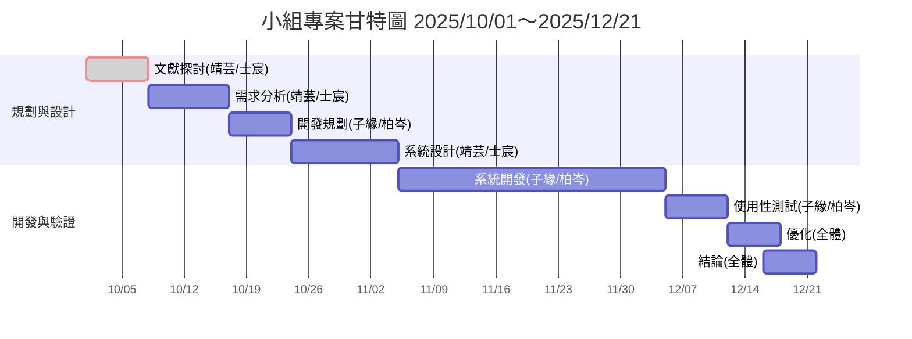

# 小組專題時程書（PERT/CPM & 甘特圖）

**日程**：2025-10-01 ～ 2025-12-21  
**成員分工**：  
- **邱靖芸(組長)/徐士宸**：文獻探討、需求分析、系統設計  
- **廖子緣/劉柏岑**：開發規劃、系統開發、使用性測試  
- **全體**：優化、結論  

---

## 任務表

| #   | 任務         | 負責           | 前置   | 天數 | 開始日     | 結束日     |
|-----|--------------|----------------|--------|------|------------|------------|
| T01 | 文獻探討     | 邱靖芸/徐士宸  | —      | 7    | 2025-10-01 | 2025-10-07 |
| T02 | 需求分析     | 邱靖芸/徐士宸  | T01    | 9    | 2025-10-08 | 2025-10-16 |
| T03 | 開發規劃     | 廖子緣/劉柏岑   | T02    | 7    | 2025-10-17 | 2025-10-23 |
| T04 | 系統設計     | 邱靖芸/徐士宸  | T03    | 12   | 2025-10-24 | 2025-11-04 |
| T05 | 系統開發     | 廖子緣/劉柏岑   | T04    | 30   | 2025-11-05 | 2025-12-04 |
| T06 | 使用性測試   | 廖子緣/劉柏岑   | T05    | 7    | 2025-12-05 | 2025-12-11 |
| T07 | 優化         | 全體           | T06    | 6    | 2025-12-12 | 2025-12-17 |
| T08 | 結論         | 全體           | T07    | 6    | 2025-12-16 | 2025-12-21 |

---

## 2️⃣ 分工細節

**邱靖芸／徐士宸**  
資料蒐集、系統設計、數據分析與簡報文本撰寫，確保理論與實作結合。

**廖子緣／劉柏岑**  
功能開發、系統測試，優化用戶體驗，協助任務收尾與文件備份。

---

## 3️⃣ PERT/CPM 依賴圖

---

## 4️⃣ 甘特圖

---
